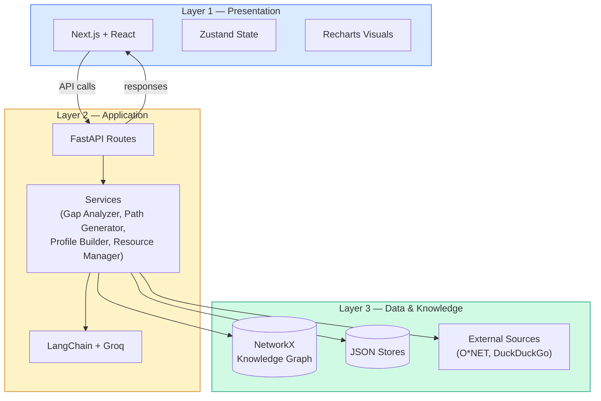
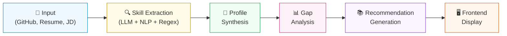
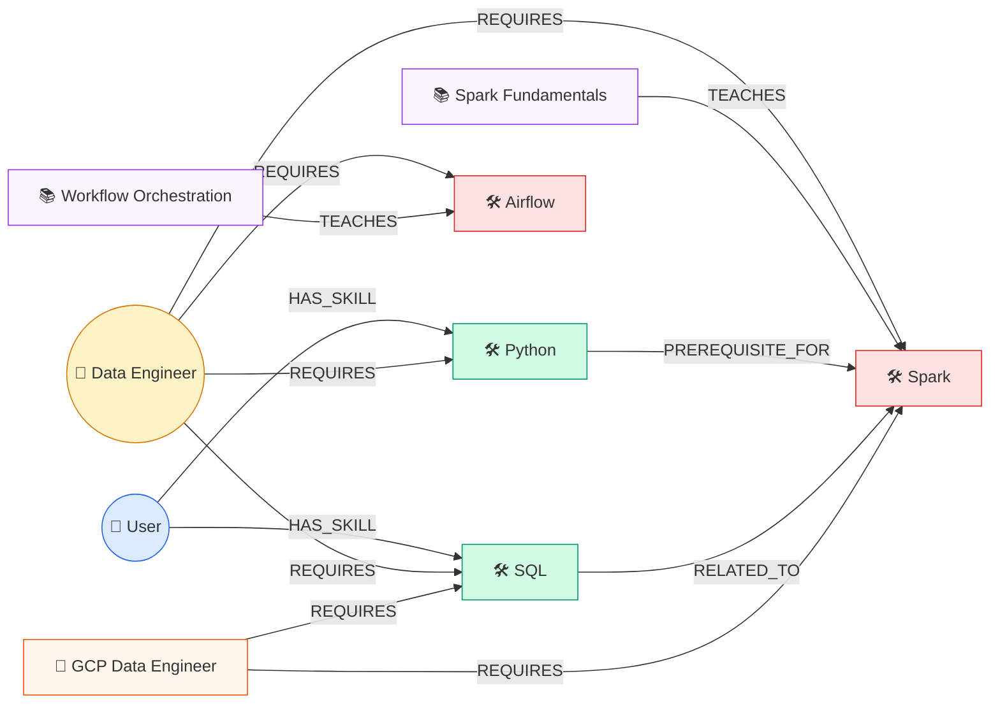
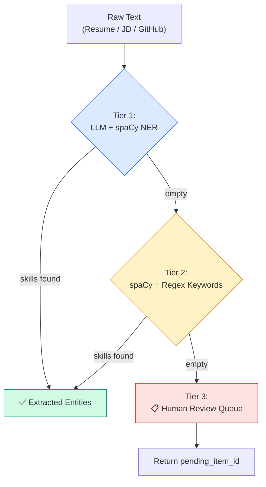
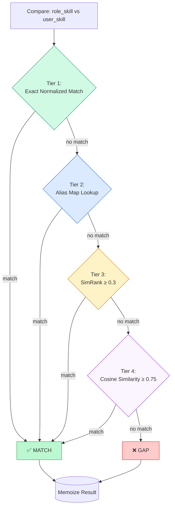
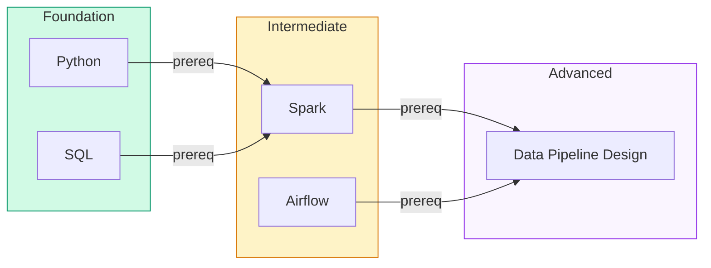
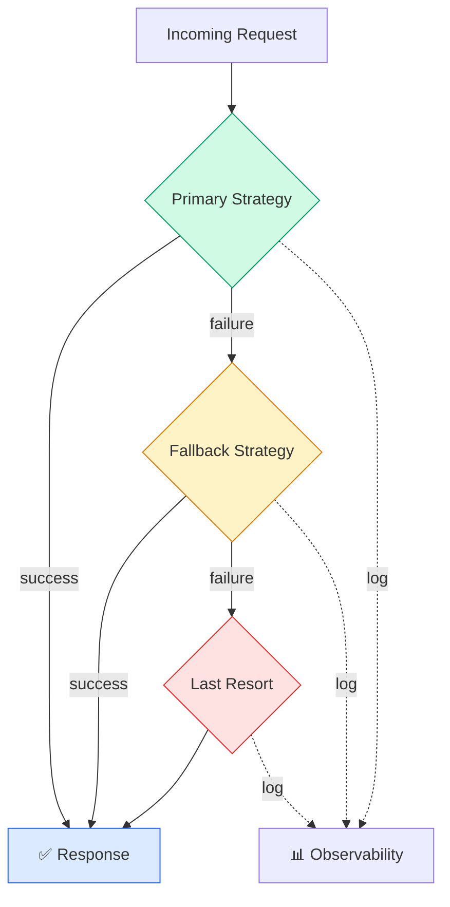

# SkillBridge — Consolidated Design Summary

> A concise overview of system architecture, algorithms, and design decisions.
> For full details, see [DESIGN_DOCUMENTATION.md](DESIGN_DOCUMENTATION.md).

---

## 1. What Is SkillBridge?

An AI-powered career navigation platform that:

1. Extracts a user's skills from GitHub profiles, resumes, and job descriptions.
2. Compares them against target-role requirements using a knowledge graph.
3. Generates a prioritized learning path with courses and certifications.

---

## 2. Architecture

**Three-layer design:**

| Layer | Tech | Responsibility |
|-------|------|----------------|
| Presentation | Next.js, React, TypeScript, Tailwind CSS, Zustand | User input, visualization, state |
| Application | FastAPI, Python 3.10+, Pydantic v2, LangChain + Groq | Business logic, extraction, matching, recommendations |
| Data & Knowledge | NetworkX, JSON stores, O\*NET, DuckDuckGo discovery | Knowledge graph, resource storage, external enrichment |

**Data flow:**

---

## 3. Knowledge Graph

- **Nodes:** skill, role, course, certification, user, company, location, domain, experience\_level, provider
- **Edges:** REQUIRES, TEACHES, HAS\_SKILL, PART\_OF, HIRES, LOCATED\_AT, RELATED\_TO, PREREQUISITE\_FOR
- **Store:** NetworkX DiGraph persisted as JSON — optimized for development speed with a clear migration path to a production graph database

> **Legend:** Green = matched skills, Red = gap skills, Purple = courses, Orange = certifications

Why a graph? The problem is fundamentally relational (user → skills → role requirements → courses). A graph models these links directly, enables path-based algorithms, and makes recommendations explainable.

---

## 4. Core Engines

### 4.1 Extraction Pipeline

Three-tier strategy, stops at the first tier that produces results:

1. **LLM + NLP:** Groq LLM extraction + spaCy NER (preferred)
2. **NLP + regex:** spaCy + keyword matcher over 150+ tech terms (no LLM)
3. **Human review queue:** Adds to pending queue with tracking ID (last resort)

### 4.2 Gap Analysis

Compares user skills to role requirements via a four-tier matching cascade:

| Tier | Method | Cost |
|------|--------|------|
| 1 | Exact normalized string match | O(1) |
| 2 | Alias map lookup | O(1) |
| 3 | SimRank (graph-based structural similarity) | O(1) cache |
| 4 | Sentence-transformer cosine similarity (≥ 0.75) | O(d), d=384 |

- **Readiness** = matched / required skills
- All match results are memoized bidirectionally
- SimRank scores and sentence-transformer embeddings are precomputed at startup

### 4.3 Learning Path Generation

- **Topological sort** orders missing skills by prerequisite dependencies into foundation → intermediate → advanced phases.
- **Dijkstra's shortest path** finds minimum-time acquisition routes over a weighted prerequisite graph (edge weight ≈ course duration).
- **Recursive transitive closure** expands indirect prerequisites via DFS.

### 4.4 Recommendation Layer

Courses and certifications are discovered through a fallback chain:
In-memory TTL cache → Knowledge graph → DuckDuckGo live discovery → Static hardcoded courses

---

## 5. Algorithms at a Glance

| Algorithm | Purpose | Used In |
|-----------|---------|---------|
| Dijkstra's shortest path | Minimum-time learning path | Optimized path generator |
| Topological sort | Prerequisite-respecting skill order | Learning path generator |
| SimRank | Structural skill similarity from shared roles/courses | Gap analyzer (Tier 3) |
| Cosine similarity (sentence-transformers) | Semantic skill matching | Gap analyzer (Tier 4) |
| Jaccard similarity | Token-level lexical matching | Knowledge source mapping |
| Levenshtein distance | Near-duplicate entity detection | Entity deduplication |
| Recursive transitive closure | Indirect prerequisite discovery | Learning path generator |

---

## 6. Fallback Architecture

**Core principle:** Always try the best approach, never depend on it exclusively.

- Missing API keys disable LLM paths at startup — no runtime surprises.
- Every AI-dependent method returns a well-typed empty result, never `None`.
- Errors in one component are contained and do not cascade.

| Component | Primary | Fallback | Last Resort |
|-----------|---------|----------|-------------|
| Extraction | Groq LLM + spaCy NER | spaCy + regex keywords | Human review queue |
| Skill Resolver | LLM canonicalization | String normalization | Identity mapping |
| Entity Linker | LLM inference | skills\_map lookup | "unknown" / empty |
| Gap Analyzer | Knowledge graph | O\*NET API | Empty skill list |
| Course Discovery | In-memory TTL cache | DuckDuckGo live | Static courses |
| Chatbot | LLM synthesis | — | Error message |
| Roadmap | LLM milestones | Cache | Static 3-step plan |

---

## 7. Key Design Decisions

| Decision | Trade-off |
|----------|-----------|
| JSON-backed graph storage | Fast prototyping, easy inspection — but limited concurrency and no transactional guarantees |
| Graph-centric recommendations | Natural relationship fit, path-based reasoning — but scaling complexity with very large graphs |
| Hybrid static + dynamic resources | Reliability from static data, freshness from live discovery — but requires cache tuning |
| SimRank for structural matching | Catches co-occurrence patterns text methods miss — but quality depends on graph density |

---

## 8. Quality & Testing

- **TDD (test driven architecture) workflow:** Scope identification → module-level tests → full regression suite → integration path checks → manual review → runtime verification → gate
- **Test suite:** 486 tests covering all services, routes, and models
- Input validation via Pydantic; environment-based secret management

---

## 9. Future Roadmap

1. **Data layer:** Structured schema for skill/course/certification nodes; weighted graph edges; data quality tooling
2. **Infrastructure:** PostgreSQL + Neo4j graph DB; background workers; distributed caching
3. **Product:** Explainable recommendations; skill progression simulation; role comparison
4. **Operations:** Telemetry dashboards; latency monitoring; alerting
5. **Security:** OAuth login; profile privacy controls; audit logging
