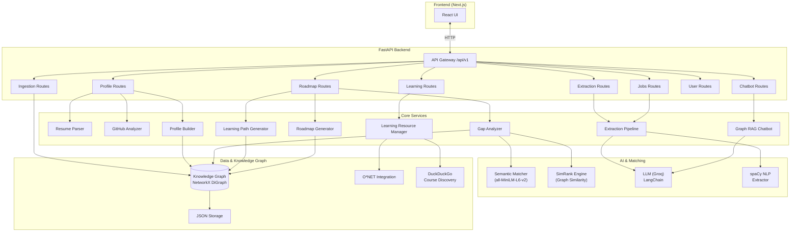
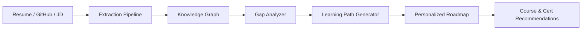

Candidate Name: Gokuldas Vedant Raikar

Scenario Chosen: SkillBridge - AI-powered skill gap analysis and dynamic learning resource recommendation using a knowledge graph.

YouTube Link - https://youtu.be/7OE8iLnh-jE?si=h1OolOSPhZyn23tG
Estimated Time Spent: ~8-12 hours

---

## High-Level Architecture



### Data Flow



---


Quick Start:
- Prerequisites:
	- Python 3.10+
	- Node.js 18+
	- `uv` installed (https://docs.astral.sh/uv/)
	- Groq API key in `.env` (`GROQ_API_KEY`)
- Run Commands:
```bash
# 1) Backend setup
uv sync
uv run python -m spacy download en_core_web_md

# 2) Run backend (from repo root)
uv run uvicorn app.main:app --reload --host 0.0.0.0 --port 8000

# 3) Frontend setup and run (new terminal)
cd frontend
npm install
npm run dev
```
- Test Commands:
```bash
# Backend tests
uv run pytest app/tests -q --tb=short --cov=app

# Frontend quality checks (no dedicated test script configured)
cd frontend
npm run lint
```

AI Disclosure:
- Did you use an AI assistant (Copilot, ChatGPT, etc.)? (Yes/No)
	- Yes (OpenCode / Github Copilot)

- How did you verify the suggestions?
	- I followed a **test-driven development (TDD) strategy** to validate all AI-assisted changes:
		1. Before accepting any AI suggestion, I identified the affected modules and their existing test coverage.
		2. I ran focused, module-level tests after each change to validate the modified behavior.
		3. I ran the full backend suite to ensure there were no regressions:
		   `uv run pytest app/tests -q --tb=short --cov=app`
		4. I confirmed key integration paths (course discovery, learning resources, and API startup) by running targeted tests and checking pass/fail results.
		5. I manually reviewed changed files to ensure fallbacks, caching behavior, and error handling matched intended logic.
		6. I validated runtime behavior with a demo script for dynamic recommendations and checked that fallback logic worked when external sources were unavailable.
		7. I only kept changes that passed tests and produced expected output in the app flow.
	- This TDD (Test Driven Developement) workflow ensures AI-generated code is validated against real test expectations before being committed.


- Give one example of a suggestion you rejected or changed:
	- I rejected relying only on static hardcoded skill-to-course mappings. I changed the design to include dynamic discovery (DuckDuckGo/fallback chain) for better coverage.
  - I rejected relying only on static hardcoded skill-to-course mappings. I changed the design to include dynamic discovery (DuckDuckGo/fallback chain) for better coverage.
  - I rejected leaving print-based error handling in services. I switched to centralized structured logging for better debugging and observability.
  - rejected keeping venv/pip-style setup in the README because my workflow uses uv. I updated commands to uv sync and uv run 
  - I rejected using a test command that assumes a frontend test script exists (npm run test) since it was not configured. I changed it to npm run lint for a valid quality check.

Tradeoffs & Prioritization:
- What did you cut to stay within the 4–6 hour limit?
	- Full database migration (stayed on JSON-backed graph storage).
	- Advanced frontend E2E test coverage.
	- Production-grade auth/RBAC and deployment hardening.
- What would you build next if you had more time?
	- **Data Layer & Skill-to-Course Mapping Improvements:**
		- Build a dedicated base data layer to replace raw JSON-backed graph storage.
		- Improve the skill-to-course mapping in the knowledge graph with richer, curated relationships (weighted edges, prerequisite depth, provider quality scores).
		- Introduce a structured schema for skill, course, and certification nodes to enforce consistency across ingestion sources.
		- Add versioning and migration support for graph data so schema evolution does not break existing profiles.
	- Introduce PostgreSQL+ Neo4j graph DB + graph persistence strategy for better scale.
	- Add recommendation ranking signals (freshness, user preference, quality metrics).
	- Add frontend integration tests and end-to-end observability dashboards.
	- Dockerize the application and create a docker-compose file for orchestration
	- Develope CI pipeline with PR and Main merge build
	- Will implement API Access control through Azure AD app roles 
	- Develope Integration Test cases via Postman and Running in Postman
	- Introduce Email Service and Report Service using Kafka
	- Optimize the code written by AI (Find and Implement optimisation Gaps)

- Known limitations
	- Dynamic external sources can vary in quality and response time.
	- JSON-backed graph is not ideal for concurrent high-write workloads.
	- Frontend currently lacks a dedicated automated test command/script.


Documentation:- 

1) DESIGN_SUMMARY.md - short summary of the design Document
1) DESIGN_DOCUMENTATION.md - detailed design and developement pattern followed


---

## API Endpoints

Base URL: `http://localhost:8000/api/v1` — Interactive docs at `http://localhost:8000/docs` (Swagger UI)

### Profile `/api/v1/profile`
| Method | Path | Description |
|--------|------|-------------|
| POST | `/github` | Build profile from GitHub account |
| POST | `/resume` | Parse resume (PDF/DOCX) and extract skills |
| POST | `/merge` | Merge multiple profile sources |
| POST | `/manual` | Create profile manually |
| PATCH | `/{user_id}` | Update profile |
| GET | `/{user_id}` | Get profile details |
| GET | `/{user_id}/graph` | Get user's knowledge graph |
| GET | `/{user_id}/readiness` | Readiness scores for target roles |
| POST | `/cache/clear` | Clear GitHub cache |
| GET | `/cache/status` | Cache statistics |

### Roadmap & Gap Analysis `/api/v1/roadmap`
| Method | Path | Description |
|--------|------|-------------|
| GET | `/roles` | List all available roles |
| GET | `/skills` | List all available skills |
| GET | `/graph` | Get knowledge graph data |
| GET | `/{user_id}/{role}/gap-analysis` | Analyse skill gaps for a target role |
| GET | `/{user_id}/{role}/roadmap` | Structured roadmap to target role |
| GET | `/{user_id}/{role}/learning-path` | Ordered path with prerequisite grouping |
| GET | `/{user_id}/{role}/fast-track` | Fastest path to job readiness |
| GET | `/{user_id}/{role}/optimized-paths` | Multiple optimized paths (fastest, most impactful, most efficient) |
| GET | `/{user_id}/{role}/requirements` | Role requirements with readiness score |

### Extraction `/api/v1/extraction`
| Method | Path | Description |
|--------|------|-------------|
| POST | `/job` | Extract skills from a job description |
| POST | `/job/background` | Background extraction |
| GET | `/job/{task_id}` | Get extraction task status |
| POST | `/course` | Extract skills from a course description |
| GET | `/pending` | List pending review items |
| POST | `/pending/{item_id}/retry` | Retry a pending item |
| POST | `/pending/{item_id}/review` | Mark item as reviewed |
| DELETE | `/pending/{item_id}` | Delete a pending item |
| GET | `/tasks` | List all extraction tasks |

### Learning Resources `/api/v1/learning`
| Method | Path | Description |
|--------|------|-------------|
| POST | `/search` | Search courses by skill with filters |
| POST | `/discover` | Discover courses for multiple skills |
| GET | `/for-skill/{skill_id}` | Courses for a specific skill |
| GET | `/providers` | Available course providers |
| GET | `/stats` | Course cache & graph stats |
| GET | `/certifications/search` | Search certifications |
| GET | `/certifications/providers` | Certification providers |
| GET | `/certifications/{cert_id}` | Certification details |
| POST | `/certifications/recommend` | Recommend certifications for skills |
| POST | `/learning-paths` | Generate learning paths |
| GET | `/for-gap-analysis` | Resources for missing skills |

### Chatbot `/api/v1/chatbot`
| Method | Path | Description |
|--------|------|-------------|
| POST | `/chat` | Ask the Graph RAG chatbot a question |
| GET | `/suggestions` | Conversation starters |
| GET | `/capabilities` | Chatbot capabilities info |

### Jobs `/api/v1/jobs`
| Method | Path | Description |
|--------|------|-------------|
| POST | `/ingest-role-batch` | Batch-ingest job descriptions |
| GET | `/` | List ingested jobs |
| GET | `/roles` | Discovered roles |
| GET | `/skills` | Discovered skills |
| GET | `/stats` | Job statistics |
| GET | `/{job_id}` | Job details |
| DELETE | `/{job_id}` | Delete a job |

### User `/api/v1/user`
| Method | Path | Description |
|--------|------|-------------|
| POST | `/` | Create a new user |
| GET | `/{user_id}/skills` | Get user skills |
| PUT | `/{user_id}/skills` | Update user skills |
| DELETE | `/{user_id}` | Delete a user |

### Ingestion `/api/v1/ingest`
| Method | Path | Description |
|--------|------|-------------|
| POST | `/job` | Ingest a job with skills |
| POST | `/course` | Ingest a course with taught skills |
| POST | `/skill` | Add a skill to the knowledge graph |
| POST | `/link` | Add a relationship link between nodes |

### Why 55 Endpoints?

SkillBridge covers **8 distinct domains**, each with multiple entity types and operations:

| Domain | Count | Rationale |
|--------|-------|-----------|
| **Profile** | 10 | Three ingestion sources (GitHub, resume, manual) with different request shapes, plus merge, caching, and graph/readiness views |
| **Roadmap** | 9 | Five analysis modes (gap, roadmap, learning-path, fast-track, optimized) — each returns a fundamentally different data structure |
| **Learning** | 12 | Courses and certifications are separate entity types with distinct schemas, providers, and search semantics |
| **Extraction** | 9 | Sync + async extraction, plus a full pending-review queue (list/retry/review/delete) for the human-in-the-loop fallback tier |
| **Jobs** | 7 | Batch ingestion + CRUD + aggregation views (by role, by skill, stats) for knowledge graph population |
| **Chatbot** | 3 | Minimal: chat, suggestions, capabilities |
| **User** | 4 | Standard CRUD for user entity + skill management |
| **Ingestion** | 4 | Low-level graph primitives for programmatic knowledge graph population |

Each resource and action gets its own route following REST conventions — collapsing them would create overloaded endpoints with complex mode-switching logic.

---